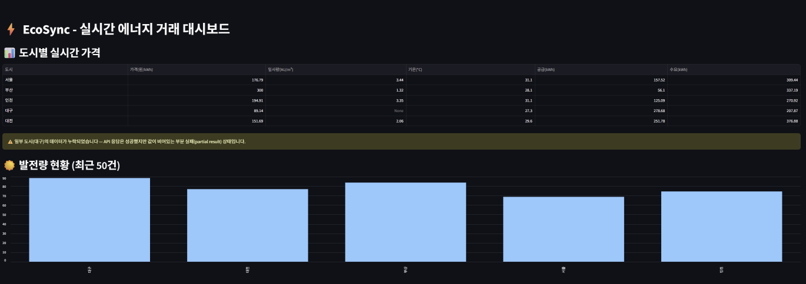

# ⚡ EcoSync — Real-Time Renewable Energy Trading Data Pipeline

**🌐 Language:** [한국어](README.md) | [English](README.en.md)

A data pipeline that brokers real-time energy trades between renewable (solar) prosumers and demand-side consumers, collecting, validating, and matching data to optimize energy efficiency.

---

## Project Background

In Jeju, solar and wind generation frequently exceed demand, and curtailment
has surged from 3 times in 2015 to around 132 times recently, with operator
losses projected in the trillions of KRW. The root cause is that generation
and demand aren't matched in real time.

One mitigation is the "microgrid" model — local self-generation, consumption,
and storage — which is spreading in Korea. In practice, though, these systems
still settle supply-demand data with delay or run on fixed rules, so they
can't fully respond to real-time volatility.

So I designed and validated a micro-batch pipeline (EcoSync) that ingests
generation data (KPX API) and demand data (dummy data) via Kafka, performs
collection/validation/matching, and computes dynamic pricing in near
real time.

> Curtailment count and loss projections are from
> [Pinpoint News, Nov 3, 2025]
> (https://www.pinpointnews.co.kr/news/articleView.html?idxno=391320).

---

## Design Philosophy

Built with a **local validation → cloud migration** strategy.

1. **Environment independence** — Runs identically anywhere via Docker, with no OS dependency
2. **Logic validation first** — Fully validate pipeline integrity with small-scale data before moving to the cloud
3. **Environment switching without code changes** — Swap only the `.env` connection settings to switch between local and Azure
4. **Infrastructure as code** — Manage Azure resources reproducibly with Terraform

> Spending cloud resources while the logic is still wrong is wasteful.  
> I validated everything locally first, then deployed the validated code as-is to the cloud.

---

## Branch Structure

| Branch | Environment | Description |
| :--- | :--- | :--- |
| `main` | Local (Docker) | Kafka + MinIO + PostgreSQL |
| `azure` | Cloud (Azure) | Event Hubs + ADLS Gen2 + Azure PostgreSQL |

---

## Screenshots

### Streamlit Dashboard


### Kafka UI


---

## Architecture

```
[KPX Real Generation API]     [Demand Dummy Data]
        ↓                        ↓
   [Kafka Producer]──────────────┘
        ↓
      [Kafka]  (generation / demand topics)
        ↓
  [Pipeline Consumer]
        ↓
   [Pydantic]          ← per-record validation (type/range/required fields)
   ↙              ↘
[data_error DLQ]   [Buffer (batches of 10)]
(manual review)         ↓
                   [Great Expectations]  ← batch-level statistical validation (distribution/outliers)
                   ↙              ↘
            [data_error DLQ]   [PostgreSQL + MinIO]
            (manual review)          ↓
                                [Matching Engine]      ← Haversine distance-based
                                     ↓
                            [Dynamic Pricing]  ← Weather API + KPX SMP
                                     ↓
                           [Streamlit Dashboard]

     ┌─────────────────────────────────────────────┐
     │      [DLQ Reprocessor] ← Cron (hourly on the hour) │
     │   Consumes dead-letter topic                   │
     │   ├─ error_type = data_error  → skip (log only) │
     │   └─ error_type = system_error → re-validate (Pydantic)│
     │        └─ on pass, republish to original topic  │
     │           (generation/demand) → back into Kafka │
     │              (re-enters pipeline from the start)│
     └─────────────────────────────────────────────┘

[DB/MinIO write failure]
   ↙                              ↘
Connection failure                Other (constraint violations, etc.)
(OperationalError,                (NotNullViolation,
 EndpointConnectionError)          ClientError, etc.)
   ↓                                  ↓
[system_error DLQ]              [data_error DLQ]
(absorbed by DLQ Reprocessor above)  (manual review)

[GE validation run itself fails] → [system_error DLQ] (entire batch of records)
```

---

## Tech Stack

| Category | Local (Docker) | Cloud (Azure) |
| :--- | :--- | :--- |
| Message Broker | Kafka + Kafka UI | Azure Event Hubs (Kafka-compatible) |
| Storage | MinIO (S3-compatible) | ADLS Gen2 |
| Database | PostgreSQL v16 | Azure Database for PostgreSQL |
| Visualization | Streamlit / Tableau | Streamlit + Power BI |
| IaC | Docker Compose | Terraform |

---

## Key Features

**1. Data Integrity Validation**
- **Stage 1 (record-level)** Pydantic — immediate type/range/required-field validation (blocks negative generation values, nulls)
- **Stage 2 (batch-level, on every 10 records)** Great Expectations — statistical outlier detection against the overall distribution (can still catch records that passed Pydantic)
- A failure at either stage → isolated to the `data_error` DLQ (manual review, logged only, not reprocessed)
- **Stage 3 (storage)** Classified by exception type on DB/MinIO write
  - Connection failures (`psycopg2.OperationalError`, `botocore.EndpointConnectionError`) → recoverable on retry, so classified as `system_error`
  - Other exceptions (`NotNullViolation`, `ClientError`, etc. — constraint/config issues) → would fail identically on retry, so classified as `data_error`
  - If the GE validation run itself fails (environment/resource issue), the entire batch is treated as transient and classified as `system_error`
  - This classification logic is covered by 6 mock-based unit tests (`tests/test_process_ge_batch.py`)
- DLQ reprocessing — the `dlq-reprocessor` container runs hourly via cron, re-validates only `system_error` records, and republishes them to the original Kafka topic so they re-enter the pipeline from the start (`data_error` records are skipped)

**2. Real-Time Trade Matching Engine**
- Distance calculation via the Haversine formula (lat/long)
- Matches to the nearest available supplier first
- Automatically falls through to the next candidate if supply is insufficient
- Match failures are logged separately

**3. Dynamic Pricing**
- Integrated with the Korea Meteorological Administration API (real-time solar radiation/temperature)
- Integrated with real KPX SMP data (replaced the previous fixed price of 150 KRW with actual market prices)
- Price computed from solar radiation coefficient × supply-demand ratio × temperature adjustment

**4. Real Data Integration**
- KPX (Korea Power Exchange) solar generation API (by region, by hour)
- KPX SMP (System Marginal Price) API
- Demand data remains dummy data due to the absence of a public API

**5. Data Quality Alerts**
- **Freshness check** — The KPX generation API is documented as "real-time," but in practice it turned out to update in batches, with the latest data frozen at a point 61 days in the past. Added a check that raises a dashboard warning whenever the gap between the latest data timestamp and the current time exceeds a threshold (7 days) (`dashboard.py`; see the dashboard screenshot above)
- **Completeness check** — Confirmed that even when an API call succeeds (no error returned), a partial failure can occur where a given city's fields come back entirely empty. Added a check that raises a warning when any required per-city column contains a missing value

  

- Both checks start from the same premise: "the request succeeded" and "the data is correct/complete" are two different questions

---

## Data Mart

### Why it was built

The original Streamlit dashboard queried `generation`/`demand` independently, each limited to "the most recent 50 records," to compute the supply-demand ratio. But since the two collectors run as independent processes, the actual time windows covered by each "most recent 50" could drift apart — a consistency problem. As more dashboards were added (Streamlit + Power BI), there was also a risk of aggregation logic diverging across screens since each would implement it separately.

To address this, a mart table, `daily_city_trading_summary`, was introduced to pre-aggregate the four raw tables (`generation`/`demand`/`trades`/`matching_errors`) by date and city.

### Structure

```
generation ─┐
demand     ─┼─→ Batch aggregation (UPSERT) ─→ daily_city_trading_summary ─→ every dashboard queries only this table
trades     ─┤
matching_errors ─┘
```

| Column | Description |
|---|---|
| `summary_date`, `city` | Aggregation key (PK) |
| `total_generation_kwh`, `total_demand_kwh` | Daily total generation/consumption |
| `matched_trade_count`, `matched_kwh` | Successful match count/volume |
| `unmatched_error_count`, `unmatched_kwh` | Failed match count/volume |
| `match_rate_kwh_pct`, `match_rate_count_pct` | Match rate (computed once in the mart, reused by every screen) |

Used FULL OUTER JOIN + COALESCE to safely default to 0 when only some of the raw tables have data for a given day, and set the match-rate denominator to NULL when it would be zero, to prevent divide-by-zero errors.

### What building the mart revealed

1. **The matching engine doesn't only use "today's generation"** — because it also draws on previously accumulated, unmatched generation inventory, trades can still occur on a day when generation is 0.
2. **A data-freshness issue in the KPX generation API** — the public data portal listed the "update frequency" as "real-time," but validating the actual API response showed the latest data was frozen at a point 61 days behind the current time. A freshness check was subsequently added to the dashboard, raising a warning whenever the delay exceeds a threshold (7 days). (See the [Velog post] for the validation process and detailed root cause.)

### How to run

```bash
# 1) Create the mart table (one-time)
docker exec -it ecosync-app python src/create_mart_table.py

# 2) Backfill historical data (one-time)
docker exec -it ecosync-app python src/run_daily_mart_batch.py --backfill 30

# 3) Reload a specific date
docker exec -it ecosync-app python src/run_daily_mart_batch.py --date 2026-07-31

# Recommend registering a nightly cron job for ongoing daily batches
docker exec -it ecosync-app python src/run_daily_mart_batch.py
```

---

## Database Schema


| Table | Role |
| :--- | :--- |
| `generation` | Raw solar generation data |
| `demand` | Demand data |
| `trades` | Successfully matched trade records |
| `matching_errors` | Match failure logs |

---

## Azure Migration (`azure` branch)

This is the version migrated from the local Docker environment to Azure Cloud.
Migration difficulty varied by component. Kafka (→ Event Hubs) and PostgreSQL
use compatible protocols, so only the connection info in `.env` needed to
change. MinIO (→ ADLS Gen2), however, uses a completely different API, so the
`boto3` client code had to be rewritten using the `azure-storage-blob` SDK.
Azure resources are provisioned with Terraform.

### Azure Resources

**Event Hubs** — Kafka-compatible message broker (generation / demand / dead-letter)


**Event Hubs Monitoring** — Real-time message processing status


**ADLS Gen2** — Raw data lake (demand/generation, partitioned by date)


**Azure Database for PostgreSQL**


### Infrastructure (Terraform)

```bash
cd terraform
terraform init
terraform plan
terraform apply
```

### Power BI Dashboard

Connects Azure PostgreSQL data to Power BI Desktop to visualize operational status.


### Pipeline Execution Logs

**Producer — Publishing data to Event Hubs**


**Pipeline — Validation, storage, and matching engine execution**


### Troubleshooting

- **Event Hubs Basic tier** → Kafka protocol unsupported (`NoBrokersAvailable`) → switched to Standard tier
- **DLQ infinite loop** → resolved via data_error / system_error classification

---

## Folder Structure

```
ecosync-project/
├── .env.example
├── docker-compose.yml
├── Dockerfile
├── requirements.txt
├── terraform/
│   ├── main.tf
│   └── variables.tf
├── sql/           
│   ├── daily_city_trading_summary.sql
│   └── daily_city_trading_summary_upsert.sql
├── logs/
│   └── dlq.log
├── docs/
│   └── images/
└── src/
    ├── data_generator.py
    ├── kafka_producer.py
    ├── kafka_consumer.py
    ├── validator.py
    ├── ge_validator.py
    ├── dead_letter_queue.py
    ├── dlq_reprocessor.py
    ├── minio_client.py
    ├── db_client.py
    ├── matching_engine.py
    ├── weather_api.py
    ├── smp_api.py
    ├── generation_api.py
    ├── dynamic_pricing.py
    ├── pipeline.py
    ├── create_mart_table.py     
    ├── run_daily_mart_batch.py   
    ├── get_all_city_prices.py 
    └── dashboard.py
```

---

## How to Run

### Local (Docker)

```bash
cp .env.example .env
docker-compose up -d
```

Terminal 1:
```bash
docker exec -it ecosync-app python src/pipeline.py
```

Terminal 2:
```bash
docker exec -it ecosync-app python src/kafka_producer.py
```

Dashboard:
```bash
docker exec -it ecosync-app streamlit run src/dashboard.py --server.address=0.0.0.0
```

Kafka UI: `http://localhost:8080`  
Streamlit: `http://localhost:8501`

### Azure (`azure` branch)

```bash
git checkout azure
cp .env.example .env
# Enter your Azure connection info in .env
```

Terminal 1:
```bash
python src/pipeline.py
```

Terminal 2:
```bash
python src/kafka_producer.py
```

DLQ reprocessing:
```bash
python src/dlq_reprocessor.py
```
