# ⚡ EcoSync — 실시간 재생에너지 거래 데이터 파이프라인

**🌐 Language:** [한국어](README.md) | [English](README.en.md)

재생에너지(태양광) 프로슈머와 수요처 간의 실시간 에너지 거래를 중개하고,  
데이터를 수집·검증·매칭하여 에너지 효율을 최적화하는 데이터 파이프라인입니다.

---

## 설계 철학

**로컬 검증 → 클라우드 이전** 전략으로 구축했습니다.

1. **환경 독립성** — Docker로 OS 종속 없이 어디서나 동일하게 실행
2. **로직 검증 우선** — 소량 데이터로 파이프라인 무결성 완전 검증 후 클라우드 이전
3. **코드 수정 없는 환경 전환** — `.env` 연결 설정만 교체하면 로컬 ↔ Azure 전환 가능
4. **인프라 코드화** — Terraform으로 Azure 리소스 재현 가능하게 관리

> 로직이 틀린 상태에서 클라우드 자원을 쓰는 건 낭비입니다.  
> 로컬에서 완전히 검증하고, 검증된 코드를 그대로 클라우드로 올렸습니다.

---

## 브랜치 구조

| 브랜치 | 환경 | 설명 |
| :--- | :--- | :--- |
| `main` | 로컬 (Docker) | Kafka + MinIO + PostgreSQL |
| `azure` | 클라우드 (Azure) | Event Hubs + ADLS Gen2 + Azure PostgreSQL |

---

## 스크린샷

### Streamlit 대시보드
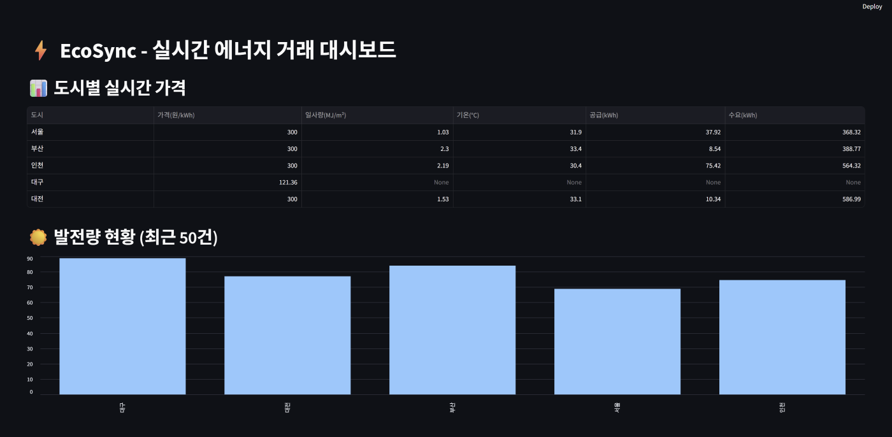
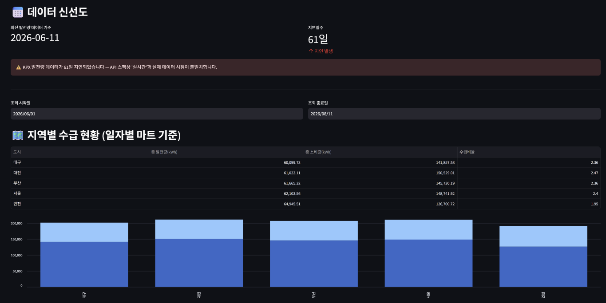
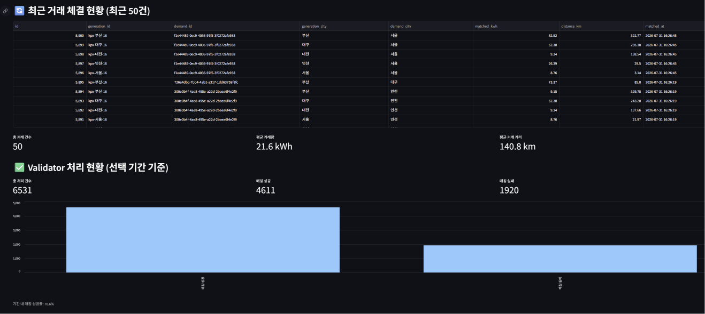

### Kafka UI
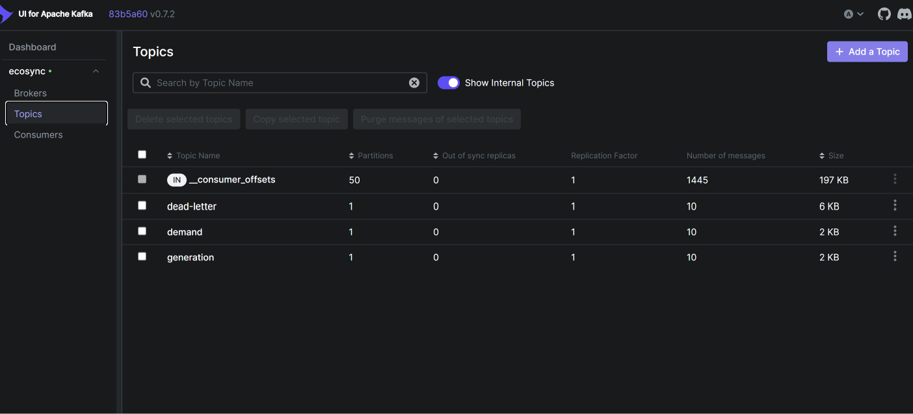

---

## 아키텍처

```
[KPX 실제 발전량 API]     [수요량 더미 데이터]
        ↓                        ↓
   [Kafka Producer]──────────────┘
        ↓
      [Kafka]  (generation / demand 토픽)
        ↓
  [Pipeline Consumer]
        ↓
   [Pydantic]          ← 개별 레코드 검증 (타입/범위/필수값)
   ↙              ↘
[data_error DLQ]   [버퍼 적재 (10개 단위)]
(수동 확인 대상)         ↓
                   [Great Expectations]  ← 배치 통계 검증 (분포/이상치)
                   ↙              ↘
            [data_error DLQ]   [PostgreSQL + MinIO]
            (수동 확인 대상)          ↓
                                [매칭 엔진]      ← Haversine 거리 기반
                                     ↓
                            [Dynamic Pricing]  ← 기상청 API + KPX SMP
                                     ↓
                           [Streamlit 대시보드]

     ┌─────────────────────────────────────────────┐
     │         [DLQ Reprocessor] ← Cron (매시 정각)  │
     │   dead-letter 토픽 소비                        │
     │   ├─ error_type = data_error  → 스킵 (로그만)  │
     │   └─ error_type = system_error → 재검증(Pydantic)│
     │        └─ 통과 시 원래 토픽(generation/demand)  │
     │           으로 재발행 → Kafka로 복귀            │
     │              (파이프라인 처음부터 재진입)        │
     └─────────────────────────────────────────────┘

[DB/MinIO 저장 실패]
   ↙                              ↘
연결 장애                        그 외 (제약조건 위반 등)
(OperationalError,               (NotNullViolation,
 EndpointConnectionError)         ClientError 등)
   ↓                                  ↓
[system_error DLQ]              [data_error DLQ]
(위 DLQ Reprocessor가 흡수)      (수동 확인 대상)

[GE 검증 실행 자체 실패] → [system_error DLQ] (배치 내 전체 레코드)
```

---

## 기술 스택

| 분류 | 로컬 (Docker) | 클라우드 (Azure) |
| :--- | :--- | :--- |
| Message Broker | Kafka + Kafka UI | Azure Event Hubs (Kafka 호환) |
| Storage | MinIO (S3 호환) | ADLS Gen2 |
| Database | PostgreSQL v16 | Azure Database for PostgreSQL |
| Visualization | Streamlit / Tableau | Streamlit + Power BI |
| IaC | Docker Compose | Terraform |

---

## 주요 기능

**1. 데이터 무결성 검증**
- **1단계 (레코드 단위)** Pydantic — 타입/범위/필수값 즉시 검증 (음수 발전량, null 차단)
- **2단계 (배치 단위, 10개 적재 시)** Great Expectations — 전체 분포 기준 통계적 이상치 감지 (Pydantic 통과분도 여기서 추가로 걸러질 수 있음)
- 두 단계 중 어디서든 검증 실패 → `data_error` DLQ 격리 (수동 확인 대상, 재처리 없이 로그만 남김)
- **3단계 (저장 단계)** DB/MinIO 저장 시 예외 타입에 따라 분류
  - 연결 장애(`psycopg2.OperationalError`, `botocore.EndpointConnectionError`) → 재처리 시 복구 가능하므로 `system_error`
  - 그 외 예외(`NotNullViolation`, `ClientError` 등 제약조건/설정 문제) → 재처리해도 동일하게 실패하므로 `data_error`
  - GE 통계 검증 실행 자체가 실패한 경우(환경/리소스 문제)도 일시적 문제로 보고 배치 내 전체 레코드를 `system_error`로 분류
  - 위 분류 로직은 mock 기반 단위 테스트 6종으로 검증됨 (`tests/test_process_ge_batch.py`)
- DLQ 재처리 — `dlq-reprocessor` 컨테이너가 Cron으로 매시 정각 실행, `system_error`만 재검증 후 원래 Kafka 토픽으로 재발행하여 파이프라인을 처음부터 다시 통과시킴 (`data_error`는 스킵)

**2. 실시간 거래 매칭 엔진**
- Haversine 공식으로 위도/경도 거리 계산
- 가장 가까운 공급자 우선 매칭
- 공급 부족 시 다음 후보로 자동 넘김
- 매칭 실패 로그 분리 적재

**3. Dynamic Pricing**
- 기상청 API 연동 (실시간 일사량/기온 데이터)
- KPX SMP 실제 데이터 연동 (기존 고정값 150원 → 실제 시장가격)
- 일사량 계수 × 수급 비율 × 기온 보정으로 가격 산출

**4. 실제 데이터 연동**
- KPX 전력거래소 태양광 발전량 API (지역별 시간별)
- KPX SMP 계통한계가격 API
- 수요량은 실제 공개 API 부재로 더미 데이터 유지

---

## 데이터베이스 스키마

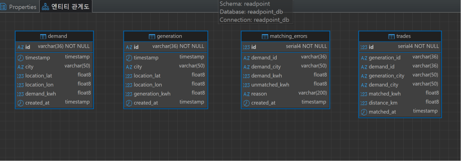

| 테이블 | 역할 |
| :--- | :--- |
| `generation` | 태양광 발전량 원본 데이터 |
| `demand` | 수요량 데이터 |
| `trades` | 매칭 성공 거래 내역 |
| `matching_errors` | 매칭 실패 로그 |

---

## Azure 이전 (azure 브랜치)

로컬 Docker 환경을 Azure 클라우드로 이전한 버전입니다.  
`.env` 연결 설정만 교체하면 동일한 코드로 동작합니다.  
Azure 리소스는 Terraform으로 프로비저닝합니다.

### Azure 리소스

**Event Hubs** — Kafka 호환 메시지 브로커 (generation / demand / dead-letter)

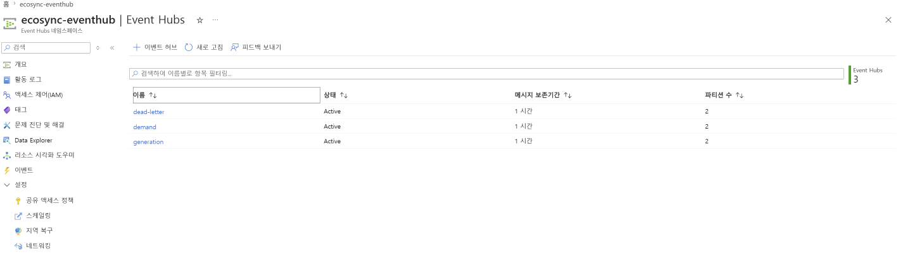

**Event Hubs 모니터링** — 실시간 메시지 처리 현황

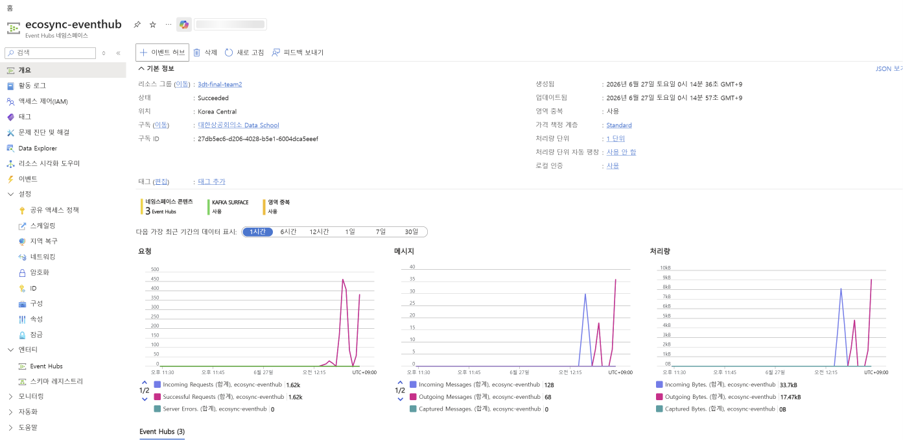

**ADLS Gen2** — 원본 데이터 레이크 (demand / generation 날짜별 적재)

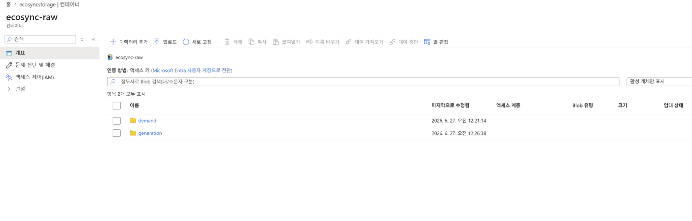

**Azure Database for PostgreSQL**

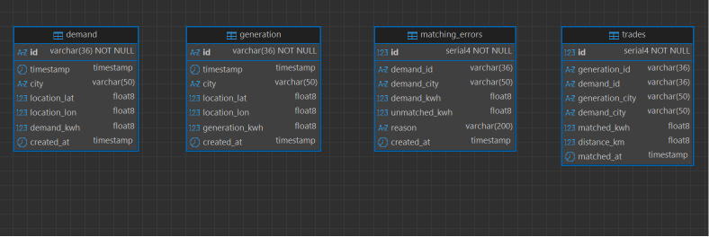

### 인프라 (Terraform)

```bash
cd terraform
terraform init
terraform plan
terraform apply
```

### Power BI 대시보드

Azure PostgreSQL 데이터를 Power BI Desktop으로 연결하여 운영 현황을 시각화합니다.

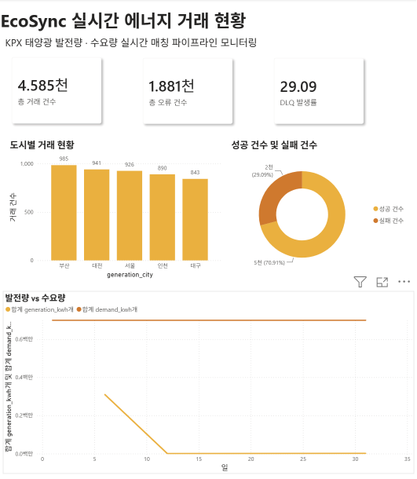


### 파이프라인 실행 로그

**Producer — Event Hubs 데이터 발행**

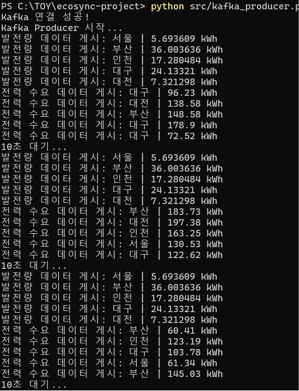

**Pipeline — 검증·적재·매칭 엔진 실행**

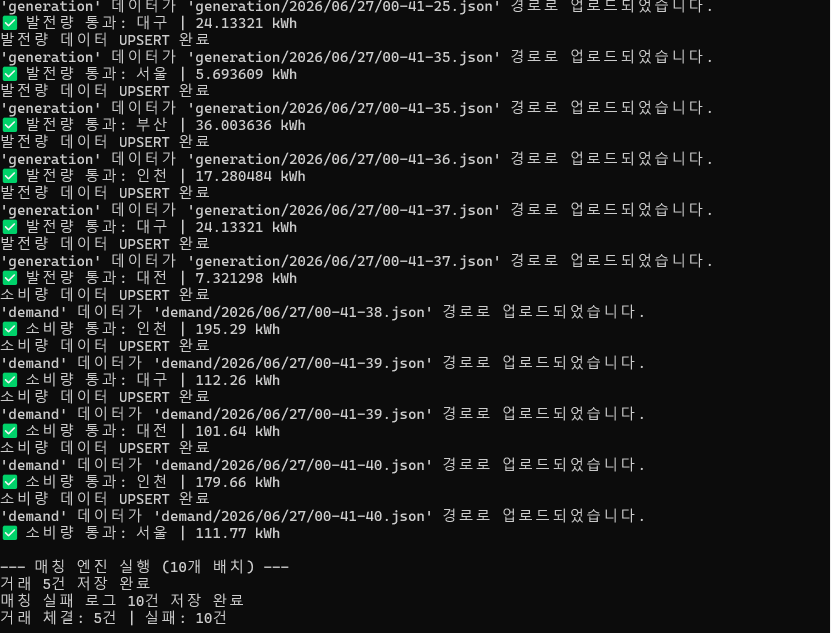

### 트러블슈팅

- **Event Hubs Basic 계층** → Kafka 프로토콜 미지원(`NoBrokersAvailable`) → Standard로 변경
- **DLQ 무한 루프** → data_error / system_error 분류로 해결

---

## 폴더 구조

```
ecosync-project/
├── .env.example
├── docker-compose.yml
├── Dockerfile
├── requirements.txt
├── terraform/              ← Azure 인프라 IaC
│   ├── main.tf
│   └── variables.tf
├── logs/
│   └── dlq.log
├── docs/
│   └── images/
└── src/
    ├── data_generator.py
    ├── kafka_producer.py
    ├── kafka_consumer.py
    ├── validator.py
    ├── ge_validator.py
    ├── dead_letter_queue.py
    ├── dlq_reprocessor.py
    ├── minio_client.py
    ├── db_client.py
    ├── matching_engine.py
    ├── weather_api.py
    ├── smp_api.py
    ├── generation_api.py
    ├── dynamic_pricing.py
    ├── pipeline.py
    └── dashboard.py
```

---

## 실행 방법

### 로컬 (Docker)

```bash
cp .env.example .env
docker-compose up -d
```

터미널 1:
```bash
docker exec -it ecosync-app python src/pipeline.py
```

터미널 2:
```bash
docker exec -it ecosync-app python src/kafka_producer.py
```

대시보드:
```bash
docker exec -it ecosync-app streamlit run src/dashboard.py --server.address=0.0.0.0
```

Kafka UI: `http://localhost:8080`  
Streamlit: `http://localhost:8501`

### Azure (azure 브랜치)

```bash
git checkout azure
cp .env.example .env
# .env에 Azure 연결 정보 입력
```

터미널 1:
```bash
python src/pipeline.py
```

터미널 2:
```bash
python src/kafka_producer.py
```

DLQ 재처리:
```bash
python src/dlq_reprocessor.py
```